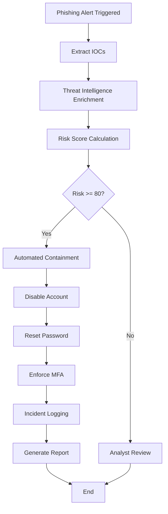

# SOAR Phishing Incident Response Playbook Flowchart

## Visual Workflow

The playbook follows this automated sequence:

1. **Phishing Alert Triggered** → Email system detects suspected phishing
2. **Extract IOCs** → Pull emails, URLs, hashes, IPs from email content
3. **Threat Intelligence Enrichment** → Lookup IOCs against VirusTotal, AbuseIPDB, MS Defender
4. **Risk Score Calculation** → Compute risk score (0-100) based on IOCs and enrichment
5. **Risk Decision (>= 80?)** 
   - **YES** → Proceed to Automated Containment
   - **NO** → Proceed to Analyst Review
6. **Automated Containment** (if risk >= 80)
   - Disable Account
   - Reset Password
   - Enforce MFA
   - Incident Logging
   - Generate Report
   - End
7. **Analyst Review** (if risk < 80)
   - Manual investigation
   - Optional escalation to containment

## Mermaid Diagram

## Workflow Description

### Phase 1: Detection & Analysis
- **Phishing Alert Triggered**: Email system flags a suspected phishing email.
- **Extract IOCs**: Extract emails, URLs, hashes, and IPs from the email content using regex patterns.
- **Threat Intelligence Enrichment**: Lookup extracted indicators against VirusTotal, AbuseIPDB, Microsoft Defender and other TI sources.
- **Risk Score Calculation**: Compute a numerical risk score (0-100) based on IOC count and enrichment results.

### Phase 2: Decision Gate
- **Risk Decision**: If risk score >= 80, proceed to automated containment. Otherwise, route to analyst for manual review.

### Phase 3: Automated Containment (High Risk)
- **Disable Account**: Disable the victim user's account in Okta or Microsoft Entra ID.
- **Reset Password**: Force a password reset to invalidate any compromised credentials.
- **Enforce MFA**: Enable or require multi-factor authentication on the account.
- **Incident Logging**: Log all containment actions for audit and compliance.
- **Generate Report**: Create an incident response report documenting the event and actions taken.
- **End**: Playbook execution complete; incident is resolved.

### Phase 3b: Analyst Review (Low Risk)
- Route the flagged email to a security analyst for manual investigation.
- Analyst may escalate to containment if additional context warrants it.

## Implementation Details

### Tools & Modules
- `extract_iocs.py`: Regex-based IOC extraction (emails, URLs, IPs, hashes).
- `enrich_iocs.py`: Optional integration with VirusTotal, AbuseIPDB, Microsoft Defender.
- `risk_score.py`: Heuristic-based risk scoring (0-100 scale).
- `isolate_account.py`: Identity provider integration (Okta, Microsoft Graph).
- `containment.py`: Orchestrates containment steps (disable, reset password, enforce MFA, block domains, quarantine emails).
- `playbook_demo.py`: End-to-end orchestrator that ties everything together.

### Configuration & Thresholds
- **Containment Threshold**: `risk_score >= 80`
- **Risk Score Components**:
  - Base: +10 per email, +15 per URL, +10 per IP, +20 per hash.
  - Enrichment adjustments: +10 for suspicious email reputation, +20 for malicious URL reputation.
  - Capped at 100.

### Safety & Extensibility
- By default, containment actions are simulated (no actual API calls unless API keys are configured).
- Real integrations can be enabled by setting environment variables: `OKTA_API_TOKEN`, `OKTA_DOMAIN`, `MS_GRAPH_TOKEN`.
- CI/CD workflows run mocked integration tests to validate the logic without real credentials.

## Future Enhancements
- Add SOAR platform-specific playbook exports (e.g., Splunk Phantom, Palo Alto Cortex XSOAR).
- Implement additional TI enrichment sources (IP geolocation, domain registration history).
- Add email quarantine integration with Exchange Online or other email gateways.
- Implement user-behavior analytics to refine scoring.
- Add supervisor approval gates before containment actions.
